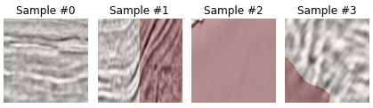
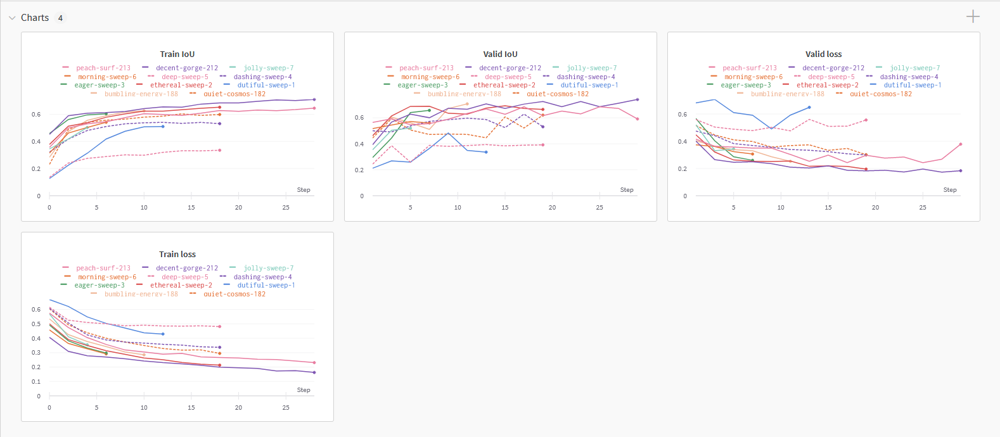
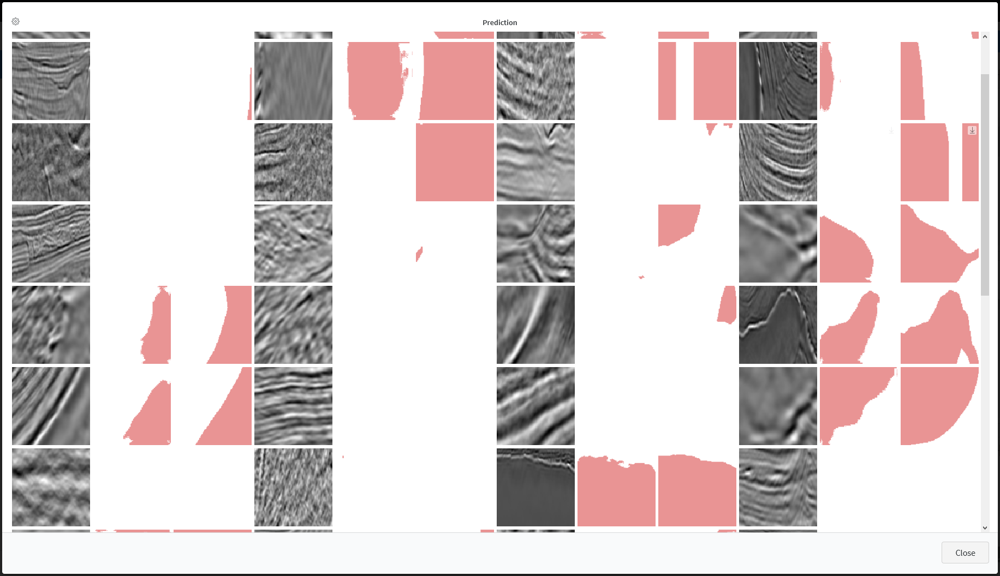
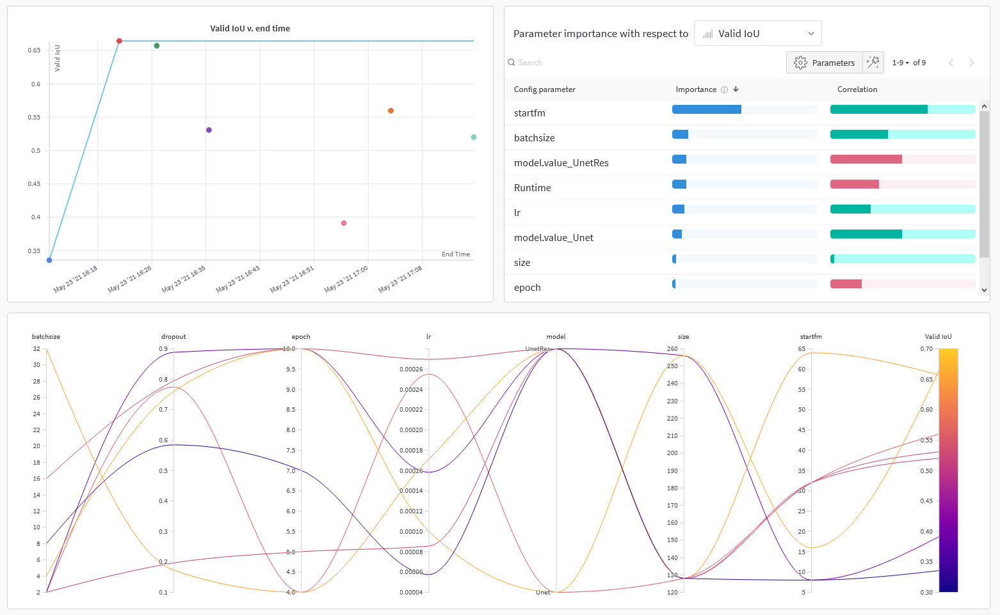

#### TGS-Salt-Identification
<a href="https://wandb.ai/nmd2000/TGS-Salt-identification/"></a>

<a href="https://colab.research.google.com/drive/1cT5zXGlwm1KBTTuDFzlVvsniNvjSzzSH?usp=sharing"></a> <a href="https://www.kaggle.com/giangphmtrng/unet-with-resnet-block-original-size"></a>

Table of contents
=================
* [Abstract](#abstract)
* [Training & Result](#Training-&-Result)
    * [Training](#Training)
    * [Result](#Result)
* [Tracking experiment](#Tracking-experiment)
    * [Tracking metrics & prediction](#Tracking-metrics-&-prediction)
    * [Tuning hyperparameter](#Tuning-hyperparameter)
* [Usage](#Usage)
* [Pretrained weight](#Pretrained-weight)
* [Team member](#Team-member)
* [Reference](#Reference)

Abstract
=================
**TGS Salt Identification** is a Kaggle Competition announced in 2018. 
The competition focus on the task of salt identification through seismic image. Seismic image is collected using reflection seismology, or seismic reflection. Take these images as example, where the red overlay region is refered to the salt region in this area:


**Data**
The data is a set of images chosen at various locations chosen at random in the subsurface, which contains 4000 images in the training dataset and 18000 images in the test set. The images are 101 x 101 pixels and each pixel is classified as either salt or sediment.

Training & Result
=================

## Training
We splited the dataset into 2 parts, 1 holds **80%** of the datset will be used for `training` and other **20%** will served for `validation`.

We implemented 2 models located in `model.py`, one is the original Unet [[1]](#1), the other is Unet based ResNet [[2]](#2). The Unet based ResNet was inspired by residual block architecture, in there, we attempt to introduce some new skip connection to the Unet architecture. The architecture of the Unet based Resnet is shown below:


However, you might experiment some downside while using this architecture than the original. We are still researching deeper into this Unet based Resnet model and the process is not finished yet. Therefore, use at your own risk.

One more thing, we implemented a custom dataset for loading TGS salt data into model. That is noticable that TGS data have 1 feature named `depths` which we didn't use for training, however, we still believe that it will bring some improvement to your model. Therefore, we still load the `depths.csv` into our datset in order to serve your later usages.
```python
class TGSDataset(Dataset):
    """TGS Salt Identification dataset."""
    
    def __init__(self, root_dir=DATA_PATH, transform=None):
        # load dataset from root dir
        train_df  = pd.read_csv(root_dir+'train.csv', index_col='id')
        depths_df = pd.read_csv(root_dir+'depths.csv', index_col='id')
        train_df = train_df.join(depths_df)

        self.depths     = train_df['z'].to_numpy()
        ...

    def __len__(self):
        ...

    def __getitem__(self, index):
        id    = self.ids[index]
        depth = self.depths[index]
        ...
```

## Result
We attempted to submit our model result as late submission to this challange. The result we got are shown belown:

| Private score | Public score |
|---------------|--------------|
| 0.74147       | 71469        |

In the developing process, we train each model 10 epoch with different hyperparameter such as: 
- the dataset's `batch size`
- the number of channel in the model `start frame`
- the `learning rate`
- the `dropout rate` for Unet Resnet model only
The result as following table:

|             | Start frame | Batch size | Learning rate | Dropout rate | Params<br>(M)   | IoU<sup>train | IoU<sup>val |
|-------------|-------------|------------|---------------|--------------|-----------------|-----------|----------|
| Unet        | 16          | 16         | 0.00017       | -            | 2.86            | 60.82     | 60.53    |
| Unet Resnet | 16          | 16         | 0.00017       | 0.5          | 7.08            | 62.91     | **67.58**|
|             |             |            |               |              |                 |           |          |
| Unet        | 32          | 16         | 0.00017       | -            | 7.76            | 72.88     | **72.1** |
| Unet Resnet | 32          | 16         | 0.00017       | 0.5          | 19.56           | 63.79     | 64.33    |
|             |             |            |               |              |                 |           |          |
| Unet        | 64          | 16         | 0.00017       | -            | 27.67           | 70.96     | **74.13**|
| Unet Resnet | 64          | 16         | 0.00017       | 0.5          | 115.26          | 64.51     | 63.13    |

**Notes:**
   - Look at result table closely, we can notice that Unet based Resnet can have up to 12.52% better than the original Unet. However, Unet Resnet with higher than 10M params seems not as good as Unet, this might due to the huge number of parameters that Unet Resnet have lead to overfiting, which easy happens when our dataset only contains 4000 images in training set.

Tracking experiment
=================
We are using [Weight & Bias (W&B)](https://docs.wandb.ai/), a great tool for tracking experiment and versioning data and weight.  

## Tracking metrics & prediction
We tracking model performance through metrics *each epoch* (in this example is Train/Valid `IoU` and `loss`), which has already implement in the source code. 



We also setup Wandb (W&B) to tracking prediction made by the model *each step* like in the example below, where the first image is *sesimic image*, the second is prediction mask of the model and the last is ground truth mask.



## Tuning hyperparameter
Wandb (W&B) provide a great agent for us to tuning our model parameter. With a limited GPU, we enable Wandb to change 7 parameter in our model which can be summary in figure below, there are `learning rate`, `dropout rate`, `batch size`, `input size`, `start frame`, `epoch` and `model`.



*Note*: To see futher runs or dig deeper in what we did, we **highly recommend** you to take a look at our project in Weight & Bias dashboard (and consider using it for your training).

<a href="https://wandb.ai/nmd2000/TGS-Salt-identification/"></a>

Usage
=================
Our work may be run in any of the following up-to-date verified environments (with all dependencies including [CUDA](https://developer.nvidia.com/cuda-zone)/[CUDNN](https://developer.nvidia.com/cudnn), [Python](https://www.python.org/) and [PyTorch](https://pytorch.org/) preinstalled):
- **Google Colab** notebooks with free GPU: <a href="https://colab.research.google.com/drive/1cT5zXGlwm1KBTTuDFzlVvsniNvjSzzSH?usp=sharing"></a> 
- **Kaggle** notebooks with free GPU: <a href="https://www.kaggle.com/giangphmtrng/unet-with-resnet-block-original-size"></a>
- **Docker Image** still working on it.

**Runs:**
To run your training, you can pass `args` into `train.py` like shown:
```
$ python train.py --run demo --batchsize 4 --epoch 50 --lr 0.00001
```
Where:
| Command     | Type             | Description                                 |
|-------------|------------------|---------------------------------------------|
| -h          |                  | Show all arguments option                   |
| --run       | str              | Your run name in Wandb (W&B)                |
| --model     | - UNet<br> - UnetRes | Declare which model your want to use        |
| -size       | int              | Image size (default: 128x128)               |
| --epoch     | int              | Number of epoch of your train               |
| --startfm   | int<br>(2<sup>n</sup> : n ∈ N<sup>*</sup>)  | Number of base channel in your architecture |
| --batchsize | int<br>(2<sup>n</sup> : n ∈ N<sup>*</sup>)  | Number of dataset's batch size              |
| --lr        | float            | Learning rate (default: 0.0001)             |
| --dropout   | float            | Dropout rate (for UNet based ResNet only)   |

You can also config the default value in `model/config.py`.

Pretrained weight
=================
As mention before, we store our trained weights in Wandb where you can find all weight version located [HERE](https://wandb.ai/nmd2000/TGS-Salt-identification/artifacts/dataset/tgs-salt/193a82f250dd4c988f2b).

We also release our latest version of the both model's (Unet and Unet based ResNet) weights. Find it at [Releases](https://github.com/manhdung20112000/tgs-salt-identification/releases).

Team member
=================
**Dung Manh Nguyen (me)**
- Github: [manhdung20112000](https://github.com/manhdung20112000)
- Email: [manhdung20112000@gmail.com](manhdung20112000@gmail.com)

**Giang Pham Truong**
- Github: [giangTPham](https://github.com/giangTPham)

**Tran Trung Thanh**
- Github: [amaggat](https://github.com/amaggat)
- Email: [thanhtt.amg@gmail.com](thanhtt.amg@gmail.com)

Reference
=================
<a id="1">[1]</a> Olaf Ronneberger, Philipp Fischer, and Thomas Brox. U-Net: Convolutional
Networks for Biomedical Image Segmentation. 2015. arXiv: 1505.04597 [cs.CV].

<a id="2">[2]</a> Karen Simonyan and Andrew Zisserman. Very Deep Convolutional Networks for
Large-Scale Image Recognition. 2015. arXiv: 1409.1556 [cs.CV].
